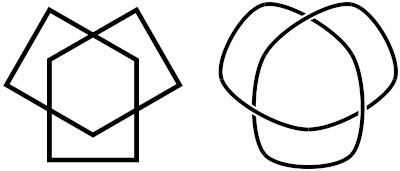
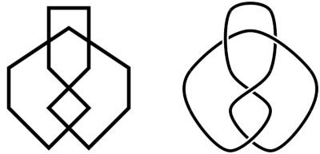

# draw_knot

A small program to generate SVG document that contains a diagram of "knot".

## Before use

The program requires jsdom.

```
npm init
npm install jsdom
```

## Usage

```
node draw_knot.js input.svg [crossing sequence] > output.svg
```

"input.svg" contains a closed "SVG Lines" of rough drawing of the knot.

The program outputs a new SVG document that connects the given end points with Catmull-Rom curve arcs, and re-group the arcs to show arc levels at each crossings.

If no "crossing sequence" is given, each crossing is presented alternation of "higher" and "lower" as they appear along the path.

If "crossing sequence" is given as a sequence of "0" and "1", each crossing is presented as "0" = "lower" and "1" = "higher".

For example,

```
node draw_knot.js input.svg 00001111 > output.svg
```

this generates a knot with the first four crossings passing with the lower level.

# Exmaples


- Prime Knot 3 (input and output)



- Prime Knot 4 (input and output)


